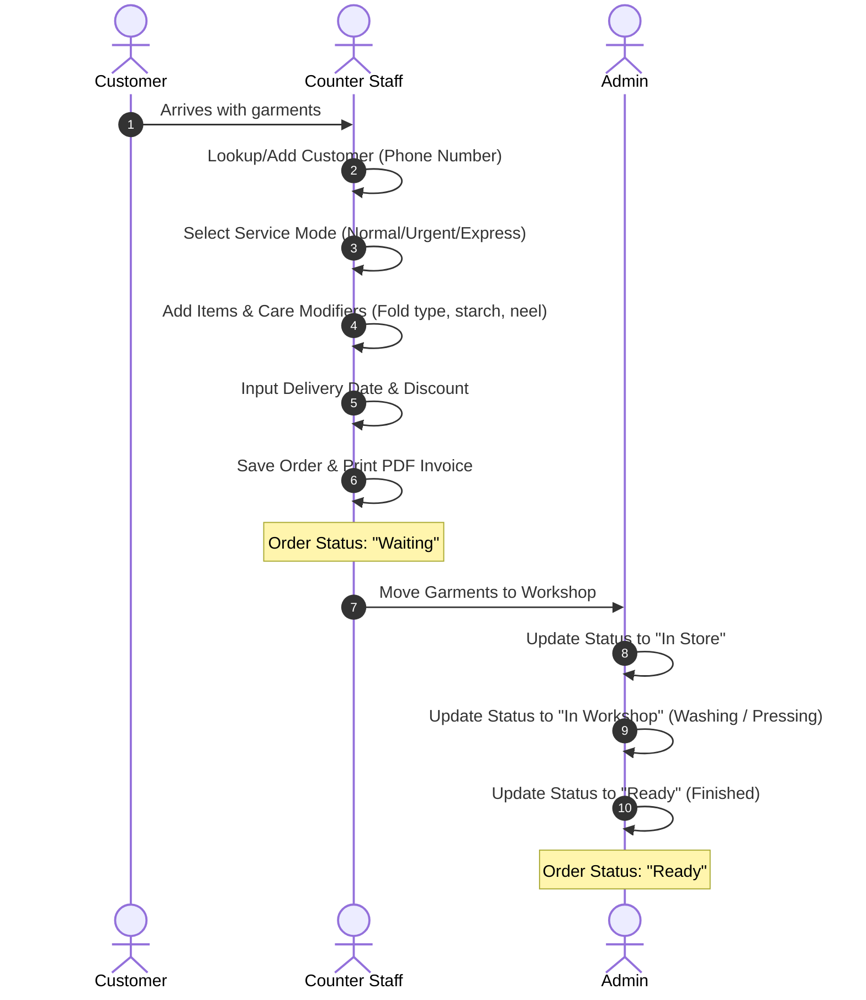
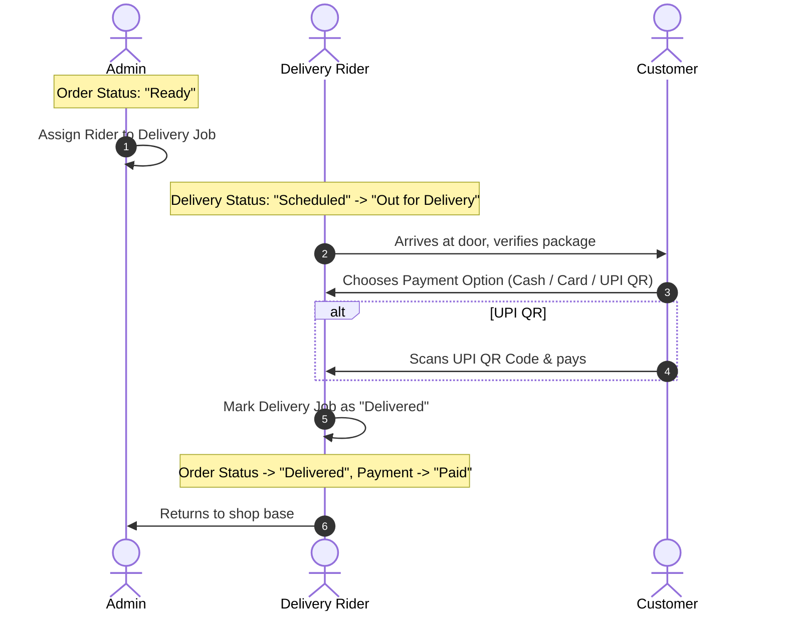

# Role-Based Navigation & Operational Workflows

This document outlines the four roles defined in Tuhama PRO, their permissions matrix, navigation paths, and concrete operational workflows.

---

## 1. System Role Capabilities Mapping

### 1.1 Super Admin (Global Controller)
* **Goal**: Complete control over all branches, global financial sheets, and user authentication accounts.
* **Access Scope**:
  * **Branch Management**: CRUD all branch offices, update branch status, assign branch managers.
  * **User Control**: Add, edit, lock, or unlock any employee account (Admin, Counter Staff, Delivery Staff).
  * **Global Analytics**: Read Consolidated financial sheets across all branches.
* **Default Navigation**:
  * `/superadmin/dashboard`
  * `/superadmin/users`
  * `/superadmin/branches`
  * `/superadmin/reports`
  * `/superadmin/settings`

### 1.2 Admin (Branch Manager)
* **Goal**: Manage operational workflows, logistics dispatch, and pricing strategies for a specific branch.
* **Access Scope**:
  * **Customer Directory**: Add, edit, or delete customer records.
  * **Order Overview**: Full control over order states. Can manually move orders through In Store, In Workshop, Ready, Delivered.
  * **Logistics Dispatch**: Assign dispatch riders to pending collection (pickup) and delivery runs.
  * **Staff Logs**: Review staff list and handle local passwords.
  * **Services & Pricing**: Modify laundry services list and active prices.
  * **Payments & Billing**: Review payments ledger and mark orders as paid.
* **Default Navigation**:
  * `/admin/dashboard`
  * `/admin/customers`
  * `/admin/orders`
  * `/admin/make-invoice`
  * `/admin/invoices`
  * `/admin/services`
  * `/admin/pickups`
  * `/admin/drivers`
  * `/admin/payments`
  * `/admin/staff`
  * `/admin/reports`
  * `/admin/settings`

### 1.3 Counter Staff (Front Desk Operator)
* **Goal**: Process walk-ins, register customer garments, collect payments, and print invoices.
* **Access Scope**:
  * **Customer Registration**: Create and search customer profiles.
  * **Ticketing / Invoicing**: Input garment details, select service modes (Normal, Dry Clean, Express, etc.), schedule deliveries, and print invoices.
  * **Order State Updates**: Progress locally handled orders.
  * **Payment Log**: Choose checkout method (Cash, Card, or UPI) and mark invoices as Paid.
* **Default Navigation**:
  * `/counter/dashboard`
  * `/counter/customers`
  * `/counter/orders/new` (Make Invoice)
  * `/counter/orders`
  * `/counter/invoices`
  * `/counter/payments`
  * `/counter/tracking`
  * `/counter/settings`

### 1.4 Delivery Staff (Logistics Specialist / Rider)
* **Goal**: Execute collections (pickups) and package drops (deliveries) on the road.
* **Access Scope**:
  * **Assigned Pickups**: Review scheduled pickups, routes, contact details, and mark as Picked Up.
  * **Assigned Deliveries**: Check package contents, address details, collect payment options, and mark as Delivered or Failed.
  * **History**: Review historical completed jobs run list.
* **Default Navigation**:
  * `/delivery/dashboard`
  * `/delivery/pickups`
  * `/delivery/deliveries`
  * `/delivery/completed`
  * `/delivery/settings`

---

## 2. Permissions Reference Matrix

The following permission tags are matched in code to toggle UI links, buttons, and block layout access:

| Permission Code | Super Admin | Admin | Counter Staff | Delivery Staff |
| :--- | :---: | :---: | :---: | :---: |
| `view_dashboard` | ✅ | ✅ | ✅ | ✅ |
| `manage_customers` | ❌ | ✅ | ✅ | ❌ |
| `manage_orders` | ❌ | ✅ | ❌ | ❌ |
| `create_orders` | ❌ | ✅ | ✅ | ❌ |
| `view_orders` | ❌ | ✅ | ✅ | ❌ |
| `track_orders` | ❌ | ✅ | ✅ | ❌ |
| `manage_services` | ❌ | ✅ | ❌ | ❌ |
| `manage_pricing` | ❌ | ✅ | ❌ | ❌ |
| `manage_pickups` | ❌ | ✅ | ❌ | ❌ |
| `view_pickups` | ❌ | ✅ | ✅ | ❌ |
| `manage_deliveries` | ❌ | ✅ | ❌ | ❌ |
| `view_deliveries` | ❌ | ✅ | ✅ | ❌ |
| `manage_payments` | ❌ | ✅ | ✅ | ❌ |
| `manage_staff` | ❌ | ✅ | ❌ | ❌ |
| `manage_roles` | ❌ | ✅ | ❌ | ❌ |
| `view_reports` | ✅ | ✅ | ❌ | ❌ |
| `manage_settings` | ✅ | ✅ | ❌ | ❌ |
| `view_analytics` | ✅ | ✅ | ❌ | ❌ |
| `export_data` | ✅ | ✅ | ❌ | ❌ |
| `manage_permissions` | ❌ | ✅ | ❌ | ❌ |
| `view_assigned_pickups` | ❌ | ❌ | ❌ | ✅ |
| `update_pickup_status` | ❌ | ❌ | ❌ | ✅ |
| `view_assigned_deliveries`| ❌ | ❌ | ❌ | ✅ |
| `update_delivery_status` | ❌ | ❌ | ❌ | ✅ |
| `view_completed_jobs` | ❌ | ❌ | ❌ | ✅ |
| `view_route_map` | ❌ | ❌ | ❌ | ✅ |

---

## 3. Core Business Workflows

### 3.1 Flow A: Order Intake & Processing (Counter & Admin)

### 3.2 Flow B: Doorstep Delivery & Payment Checkout (Admin & Delivery Staff)

