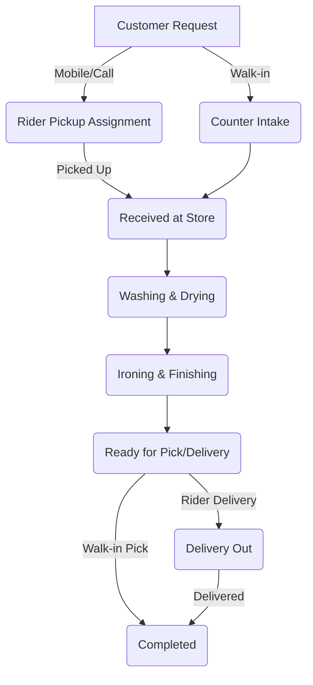

# SpinClean PRO - Business Requirements Document

## 1. Product Overview
**SpinClean PRO** is an enterprise-grade commercial laundry operations suite designed to automate and streamline laundry management for multi-branch laundry services. The system coordinates walk-in ticketing at counter desks, manages pickup/delivery logistics handled by dispatch riders, and provides administrative oversight on service definitions, pricing, staff performance, and revenue reports.

---

## 2. Target Users & Roles
The application serves three primary operational user categories:
1. **System Administrator (Admin):** Manages branches, registers staff, configures service catalogs, monitors finances, modifies access permissions, and reviews business intelligence dashboards.
2. **Counter Staff:** Facilitates front-desk customer relations, registers walk-in/phone-in clients, logs new orders with precise garment counts, processes payments, updates status flags, and prints invoices.
3. **Delivery Specialist / Dispatch Rider:** Operates the logistics workflow. Views assigned pickups and deliveries, routes to customer addresses, updates job execution status in real-time, and handles field payment collections.

---

## 3. Core Functional Workflows

### 3.1 Counter Intake & Order Processing
- **Customer Directory:** Ability to register new customers on-the-fly and search existing customer records by phone, name, or email.
- **Order Ticket Creation:** intake of items including garment categorization, quantity, unit pricing calculation, tax application, and special care instructions (e.g., "handle with care", "low heat dry").
- **Payment Collection:** Processing transactions at intake or upon final retrieval, with supports for Cash, Card, and Digital Wallet methods.
- **Status Progression tracking:** Walk-in orders cycle through: `Received` $\rightarrow$ `Washing` $\rightarrow$ `Ironing` $\rightarrow$ `Ready` $\rightarrow$ `Delivered`.

### 3.2 Pickup & Delivery Dispatch
- **Rider Allocation:** System assigns standard pickups and deliveries to available delivery staff.
- **Field Pickup Flow:** Dispatch riders view scheduled pickups, navigate to client locations, receive raw garments, and label them as `Picked Up` to notify the counter desk.
- **Field Delivery & Billing:** Riders collect processed garments, verify payment statuses, process pending balances on the doorstep, and mark jobs as `Delivered` upon customer sign-off.

### 3.3 Administrative Management & Pricing
- **Staff Control Panel:** Registering new staff accounts, editing details, managing status (Active, Inactive, Suspended), and tracking individual staff metrics (e.g. orders handled, payments collected).
- **Service Catalog:** Dynamic customization of service items (e.g. "Wash & Fold", "Dry Cleaning", "Stain Removal"), categories, pricing models (per kg or per piece), and estimated completion times.
- **Business Intelligence & Reporting:** Live visual charts detailing revenue gains, order status counts, and staff productivity metrics, combined with exports to PDF invoices, XLS spreadsheets, and CSV files.

---

## 4. Non-Functional Requirements
- **Responsive Web Interface:** Seamless operation across wide desktop screens (used at counter desks) and mobile devices (used by dispatch riders on the road).
- **Global Usability:** Multi-language support (English & Spanish translation system) to accommodate diverse staff requirements.
- **UI Styling Adaptability:** Full Dark Mode support to ease visual strain during long night shifts at processing plants.
- **Performant Visual Feedback:** Application of skeleton loading frames and toast indicators to maintain a high-fidelity application response feel.
