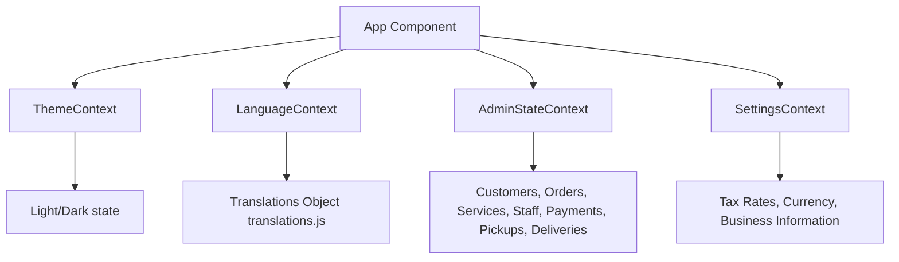

# Frontend Architecture Document

## 1. Technical Stack Overview
SpinClean PRO is structured as a modern Single Page Application (SPA) using React.

* **Core Framework:** React 19.2.6
* **Routing Engine:** React Router DOM 6.26.1
* **Styling & Theme Engine:** TailwindCSS 3.4.19 + PostCSS + Custom CSS (`admin.css`, `Login.css`)
* **Animations:** Framer Motion 11.2.10
* **API Communications:** Axios 1.7.2 (prepared for backend integration)
* **Key Visual Libraries:**
  - `react-icons/fi` (Feather Icons pack)
  - `react-toastify` (Real-time toast alert banners)
  - `react-loading-skeleton` (Skeleton load frames for visual smoothness)
  - `jspdf` & `jspdf-autotable` (Invoice and data export generation)

---

## 2. Directory Structure

```
src/
├── assets/             # Global visual assets, logo SVGs, login hero image
├── Components/         # Reusable presentation and UI shell components
│   ├── counter/        # Counter-specific sub-components
│   ├── delivery/       # Delivery-specific sub-components
│   └── *.jsx           # Shared components (Sidebar, Navbar, Tables, Charts)
├── constants/          # Status styles mappings, utility colors
├── context/            # React Context State management modules
├── data/               # Mock data sources and mock generators
├── layouts/            # Layout wrappers (Admin, Counter, Delivery Layouts)
├── Pages/              # Page view containers grouped by user role
│   ├── admin/          # Admin portal pages (Staff, Orders, Services, Reports)
│   ├── counter/        # Counter staff pages (Dashboard, Ticketing, Customers)
│   ├── delivery/       # Delivery rider pages (Assigned Jobs, Completed Runs)
│   └── Login/          # Authentication entry page
├── styles/             # Modular stylesheet rules (admin.css)
├── utils/              # Calculation scripts, PDF/Excel export helpers
├── App.js              # Routing root and top-level layouts wrapping
└── index.js            # React mount bootstrap setup
```

---

## 3. Global State Architecture
State management is handled natively using the **React Context API**, ensuring lightweight and optimized data flow across the client:



### 3.1 AdminStateContext (`/src/context/AdminStateContext.js`)
Serves as the client-side data warehouse. Maintains and mutates lists of:
* `customers`: Active directory. Helper: `addCustomer(customer)`
* `orders`: Centralized ticketing tracking. Helpers: `addOrder(order)`, `updateOrderStatus(orderId, status)`
* `services`: Laundry services catalog. Helper: `addService(service)`
* `staff`: Registered employee roster. Helper: `addStaff(member)`
* `payments`: Historical ledger of sales.
* `pickups` / `deliveries`: Logistics coordinates. Helpers: `updatePickupStatus`, `updateDeliveryStatus`

### 3.2 LanguageContext (`/src/context/LanguageContext.jsx`)
Handles client-side localization. Loads language translations from `translations.js` (supporting English/Spanish toggles) and exposes the translations mapping `t(key)`.

### 3.3 ThemeContext (`/src/context/ThemeContext.jsx`)
Maintains `theme` state (`light` or `dark`). Adds/removes the `.dark` class name prefix on the `html` root container to trigger Tailwind theme variables.

### 3.4 SettingsContext (`/src/context/SettingsContext.jsx`)
Houses system configuration presets like tax percentages, store address, currency symbols, and business name references.

---

## 4. Routing Architecture
The application uses nested routes under `src/App.js` to separate concerns and lay out screens depending on user roles:

- `/` $\rightarrow$ Login Portal
- `/admin/*` $\rightarrow$ Wraps inside `AdminLayout.jsx` & `AdminStateProvider`
  - `/admin/dashboard` $\rightarrow$ Revenue and status statistics overview.
  - `/admin/customers` $\rightarrow$ Directory of registered customers.
  - `/admin/orders` $\rightarrow$ Global order ledger.
  - `/admin/services` $\rightarrow$ Services pricing adjustments.
  - `/admin/staff` $\rightarrow$ Staff directory and detail panels.
  - `/admin/reports` $\rightarrow$ Financial export generators.
- `/counter/*` $\rightarrow$ Wraps inside `CounterLayout.jsx`
  - `/counter/dashboard` $\rightarrow$ Front desk operations, stats.
  - `/counter/customers` $\rightarrow$ Walk-in profile creator.
  - `/counter/orders/new` $\rightarrow$ Garment inventory drop-off flow.
  - `/counter/orders` $\rightarrow$ Order status monitoring.
- `/delivery/*` $\rightarrow$ Wraps inside `DeliveryLayout.jsx`
  - `/delivery/dashboard` $\rightarrow$ Rider workload metrics.
  - `/delivery/pickups` $\rightarrow$ Collect orders routing.
  - `/delivery/deliveries` $\rightarrow$ Drop-off garments routing.

---

## 5. UI Layout Structure
Each dashboard role is framed by a specialized layout component:
* **AdminLayout:** Composed of `Sidebar.jsx`, `Navbar.jsx`, and a main scrollable content region. Responsive toggles collapse the sidebar on smaller viewports.
* **CounterLayout:** Custom-tailored `CounterSidebar.jsx` and `Navbar.jsx` focusing on walk-in tickets and rapid input fields.
* **DeliveryLayout:** Minimalist mobile-friendly header and `DeliverySidebar.jsx` containing direct routing options for quick mapping.
